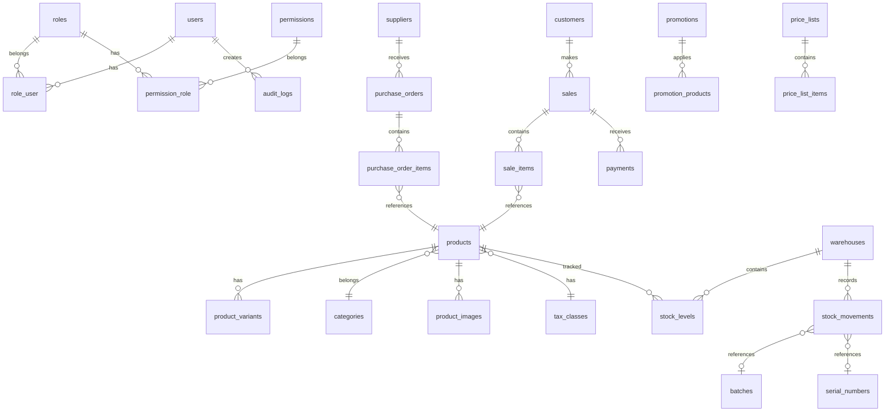

# Database Schema & Migrations

## ER Diagram (Mermaid)

## Migration List (Order)

### Phase 1: Core & Auth
1. `create_users_table`
2. `create_roles_table`
3. `create_permissions_table`
4. `create_role_user_table`
5. `create_permission_role_table`
6. `create_audit_logs_table`
7. `create_settings_table`
8. `create_personal_access_tokens_table`

### Phase 2: Products & Inventory
9. `create_categories_table`
10. `create_tax_classes_table`
11. `create_products_table`
12. `create_product_variants_table`
13. `create_attributes_table`
14. `create_attribute_values_table`
15. `create_product_attributes_table`
16. `create_product_images_table`
17. `create_warehouses_table`
18. `create_stock_levels_table`
19. `create_stock_movements_table`
20. `create_batches_table`
21. `create_serial_numbers_table`

### Phase 3: Sales & POS
22. `create_customers_table`
23. `create_customer_groups_table`
24. `create_payment_methods_table`
25. `create_sales_table`
26. `create_sale_items_table`
27. `create_payments_table`
28. `create_held_orders_table`
29. `create_returns_table`
30. `create_credit_notes_table`

### Phase 4: Purchases
31. `create_suppliers_table`
32. `create_purchase_orders_table`
33. `create_purchase_order_items_table`
34. `create_purchase_receipts_table`
35. `create_supplier_returns_table`
36. `create_price_lists_table`
37. `create_price_list_items_table`

### Phase 5: Promotions & Reports
38. `create_promotions_table`
39. `create_promotion_products_table`
40. `create_coupons_table`
41. `create_loyalty_points_table`
42. `create_scheduled_reports_table`

---

## Key Tables Schema

### users
| Column | Type | Notes |
|--------|------|-------|
| id | BIGINT | PK |
| name | VARCHAR(255) | |
| email | VARCHAR(255) | Unique |
| phone | VARCHAR(50) | Nullable |
| password | VARCHAR(255) | Hashed |
| locale | VARCHAR(5) | ar/en |
| is_active | BOOLEAN | Default true |
| created_at | TIMESTAMP | |
| updated_at | TIMESTAMP | |

### products
| Column | Type | Notes |
|--------|------|-------|
| id | BIGINT | PK |
| sku | VARCHAR(100) | Unique |
| barcode | VARCHAR(100) | Nullable, indexed |
| name_en | VARCHAR(255) | |
| name_ar | VARCHAR(255) | |
| type | ENUM | simple, variant, bundle, service |
| category_id | BIGINT | FK |
| tax_class_id | BIGINT | FK, nullable |
| cost_price | DECIMAL(15,3) | LYD |
| sale_price | DECIMAL(15,3) | LYD |
| is_active | BOOLEAN | |

### sales
| Column | Type | Notes |
|--------|------|-------|
| id | BIGINT | PK |
| invoice_number | VARCHAR(50) | Unique |
| customer_id | BIGINT | FK, nullable |
| user_id | BIGINT | FK (cashier) |
| warehouse_id | BIGINT | FK |
| subtotal | DECIMAL(15,3) | |
| tax_total | DECIMAL(15,3) | |
| discount_total | DECIMAL(15,3) | |
| grand_total | DECIMAL(15,3) | |
| status | ENUM | completed, refunded, partial |
| idempotency_key | VARCHAR(36) | UUID for offline sync |
| created_at | TIMESTAMP | |

### stock_levels
| Column | Type | Notes |
|--------|------|-------|
| id | BIGINT | PK |
| product_id | BIGINT | FK |
| variant_id | BIGINT | FK, nullable |
| warehouse_id | BIGINT | FK |
| quantity | DECIMAL(15,3) | |
| reserved | DECIMAL(15,3) | For pending orders |
| reorder_point | DECIMAL(15,3) | |
